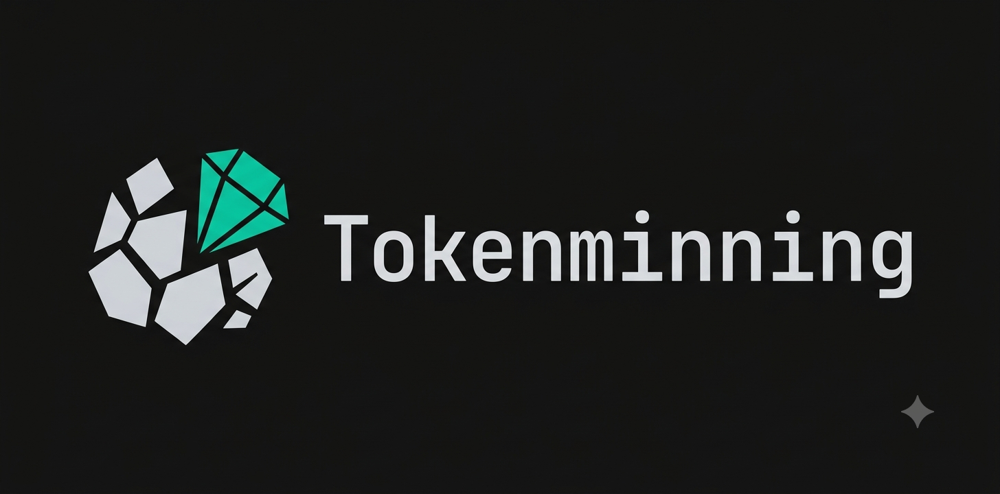
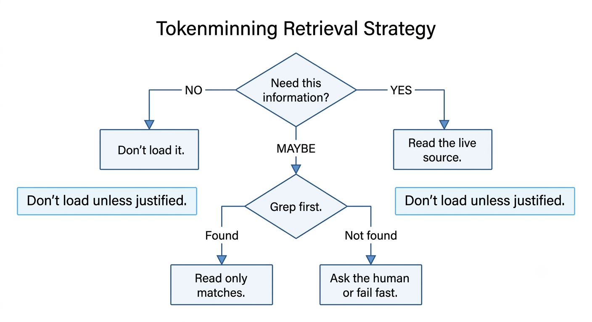
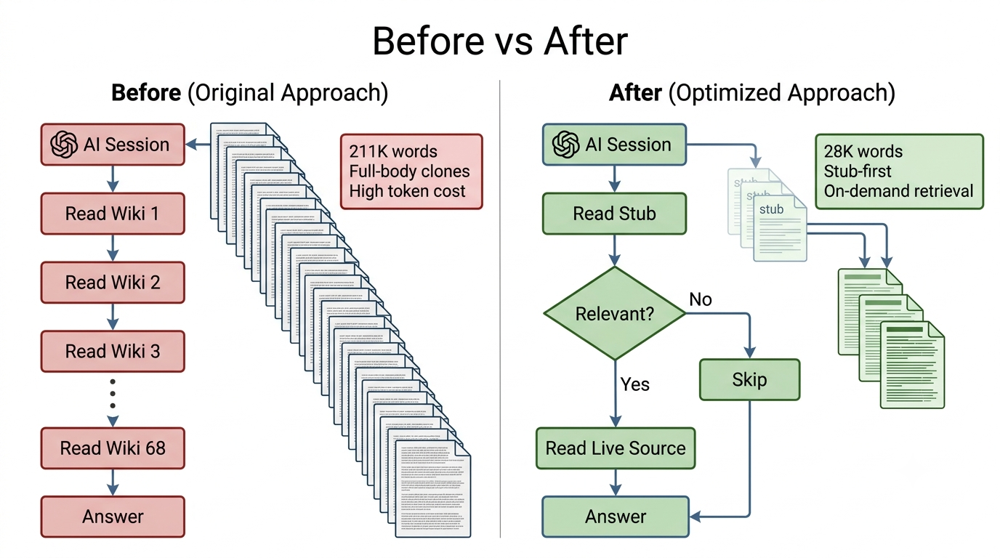
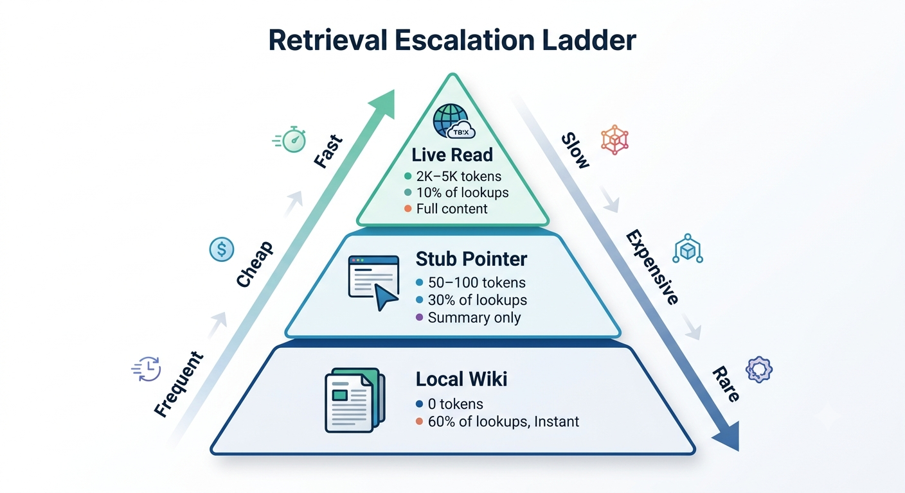
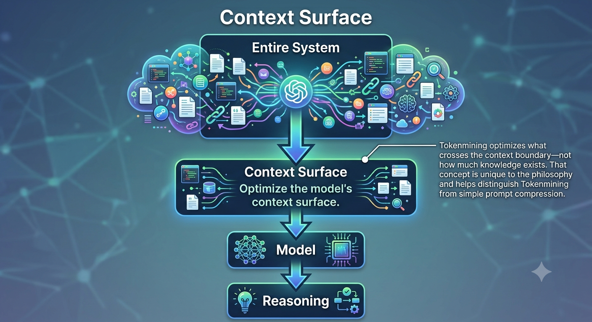

# Tokenminning

<p align="center">
  
</p>

<p align="center">
  <strong>Maximize intelligence per token</strong>
  <br/>
  <em>Not by minimizing tokens, but by delivering the right context at the right time</em>
</p>

<p align="center">
  <a href="https://github.com/zwolf25/tokenminning/stargazers"></a>
  <a href="https://github.com/zwolf25/tokenminning/commits/main"></a>
  <a href="https://github.com/zwolf25/tokenminning/commits/main"></a>
  <a href="LICENSE"></a>
  <a href="https://github.com/zwolf25/tokenminning/pulls"></a>
  <a href="https://medium.com/@zwolf25"></a>
</p>

<p align="center">
  <a href="#case-studies">Case Studies</a> •
  <a href="#principles">Principles</a> •
  <a href="#techniques">Techniques</a> •
  <a href="#real-world-results">Results</a> •
  <a href="CONTRIBUTING.md">Contributing</a> •
  <a href="https://medium.com/@zwolf25">Articles</a>
</p>

---

## Why Tokenminning?

| Tokenmaxxing | Tokenminning |
|:---|:---|
| "How do I give the model **more** context?" | "How do I give the model the **right** context?" |
| Add more context | Add **better** context |
| Bigger prompts | **Denser** prompts |
| Load everything | **Retrieve what matters** |
| More memory | **Better memory architecture** |
| More tokens | **More intelligence per token** |

> **Tokenminning is not:** minimizing tokens to cut costs, aggressively shortening prompts, removing useful context, or avoiding large context windows.
>
> **Tokenminning is:** improving information density, eliminating context debt, and designing systems where the right context arrives at the right time.


---

## Quick Start

Tokenminning isn't a tool—it's a design philosophy. Apply it in 3 steps:

```bash
# 1. Audit what's always loaded
grep -r "always.*load\|preload\|startup" .claude/ CLAUDE.md

# 2. Replace full clones with stubs (summary + source-path)
# 3. Add escalation ladder: local cache → stub → on-demand read
```

**Start here:** Read the [Principles](#principles) → Pick a [Case Study](#case-studies) → Apply one technique to your setup.

---

## Principles

| # | Principle | One-Liner |
|:---:|:---|:---|
| 1 | **🔍 Retrieve, don't preload** | Supply relevance on demand |
| 2 | **🗜️ Compress, don't repeat** | Cut redundant instructions & history |
| 3 | **📋 Structure, don't narrate** | Prefer structured data over prose |
| 4 | **🎯 Spend tokens where reasoning matters** | Allocate budget to high-value thinking |
| 5 | **🏗️ Design systems, not prompts** | Architecture (retrieval, tools, memory) drives savings |
| 6 | **⚙️ Optimize context, not complexity** | "What does the model need right now?" |
| 7 | **🧹 Eliminate context debt continuously** | Audit memories, routing, config like production code |



> [!NOTE]
> These principles emerged from production Second Brain workflows at ServiceChannel, not theoretical speculation.

---

## Techniques

| Technique | Description | Case Study |
|:---|:---|:---|
| **Stub Pattern** | Replace full clones with `summary + source-path` pointers | [Second Brain](#case-study-1-second-brain) |
| **Grep-before-read** | Never read a folder wholesale; search first | [Config Audit](#case-study-2-config-audit) |
| **Escalation Ladder** | Level 1: local cache → Level 2: stub lookup → Level 3: on-demand read | [All] |
| **Compaction** | Keep active context ≤ 15K tokens | [Wiki Pipeline](#case-study-3-wiki-pipeline) |
| **Thin Routers** | Startup instructions = behavior/routing only; retrieve details on demand | [Config Audit] |
| **Single Source of Truth** | Store durable knowledge once, reference everywhere | [All] |

---

## Real-World Results

| Metric | Before | After | Change |
|:---|:---:|:---:|:---:|
| **Second Brain wiki words** | 211K | 28K | **87% ↓** |
| **Wiki pipeline cost/run** | $50+ (11 agents) | $15–25 (2–3 agents) | **~70% ↓ cost, 80% ↓ agents** |
| **CLAUDE.md size** | ~48.6 KB | 34.4 KB | **29% ↓ (~3,500 tokens/session)** |
| **Stale sync clones** | 66% | 0% | **100% eliminated** |
| **RTK adoption gap** | 94% commands bypassed | → upstream fix | **1.5M tokens/30d recovered** |

> [!NOTE]
> These are measured results from production Second Brain workflows, not synthetic benchmarks.

---

## Case Studies

<details>
<summary><strong>Case Study 1: Second Brain — 211K → 28K words (87% reduction)</strong></summary>

**Problem:** Team knowledge vault full of full-body clones  
**Fix:** Stub Pattern + Grep-before-read + Escalation ladder  
**Result:** 87% word reduction, $15–25 → $2–4/session, 66% → 0% stale clones

[Read full case study →](examples/second-brain-system.md)
</details>

<details>
<summary><strong>Case Study 2: RTK & LLMLingua Evaluation — 1.5M token adoption gap found</strong></summary>

**Problem:** Which external token tools improve CLI setup?  
**Fix:** Evaluated 4 repos → kept RTK (deterministic tool-output compression), rejected LLMLingua (lossy prompt compression)  
**Discovery:** `rtk discover` revealed only 6% of Bash calls used RTK (~1.5M tokens/30d missed)

[Read full case study →](examples/rtk-llmlingua-evaluation.md)
</details>

<details>
<summary><strong>Case Study 3: Config & Memory Audit — 3,500 tokens/session recurring savings</strong></summary>

**Problem:** CLAUDE.md files bloated, MEMORY.md growing unbounded  
**Fix:** 4-type memory classification + CLAUDE.md consistency audit + monthly auto-enforcement  
**Result:** 29% CLAUDE.md reduction, MEMORY.md → 0 bytes, recurring ~3,500 tokens/session saved

[Read full case study →](examples/second-brain-config-audit.md)
</details>

<details>
<summary><strong>Case Study 4: Wiki Pipeline — $50 → $15/run (80% fewer agents)</strong></summary>

**Problem:** Cleanup skill defaulted to full-vault audit (92 wikis) when only 12 changed  
**Fix:** Added "recently-touched" scope tier seeded from builder run; full-vault now opt-in via `--full`  
**Result:** 11→2–3 agents, ~70% cost reduction, 4 root-cause fixes across 2 skills

[Read full case study →](examples/wiki-pipeline.md)
</details>

---

## How It Works

Tokenminning operates on a simple **escalation ladder** — the model only sees what it needs, when it needs it:

```
┌─────────────────────────────────────────────────────────────┐
│  LEVEL 1: LOCAL CACHE                                       │
│  Hot context, recent decisions, active task state           │
│  → Always loaded, ≤ 2K tokens                               │
├─────────────────────────────────────────────────────────────┤
│  LEVEL 2: STUB LOOKUP                                       │
│  Summary + source-path pointers to durable knowledge        │
│  → Loaded on reference, ~500 tokens each                    │
├─────────────────────────────────────────────────────────────┤
│  LEVEL 3: ON-DEMAND READ                                    │
│  Full source content retrieved only when explicitly needed  │
│  → Lazy, precise, unbounded depth                           │
└─────────────────────────────────────────────────────────────┘
```

**The key insight:** Most systems preload Level 3. Tokenminning makes Level 1 the default, Level 2 the bridge, Level 3 the exception.




---

## Related Projects

| Project | Description | Relation |
|:---|:---|:---|
| **[RTK](https://github.com/rtk-ai/rtk)** | Rust CLI proxy for tool-output compression (60-90% savings) | Complementary — handles command output; tokenminning handles context architecture |
| **[Caveman](https://github.com/JuliusBrussee/caveman)** | Terse communication mode (65% fewer output tokens) | Sibling — reduces prompt verbosity; tokenminning reduces context surface |
| **[Ponytail](https://github.com/DietrichGebert/ponytail)** | YAGNI code generation philosophy (~54% less code) | Sibling — reduces implementation bloat; tokenminning reduces context bloat |
| **[GPTCache](https://github.com/zilliztech/GPTCache)** | Semantic caching for LLM APIs | Different layer — caches model responses; tokenminning optimizes what reaches the model |

---

## Contributing

We welcome real-world examples, counterexamples, benchmarks, and tool-specific patterns.

1. **Case studies** — Add to `examples/` in `case-study-XX-name.md` format
2. **Techniques** — Document patterns in `techniques/`
3. **Counterexamples** — Where tokenminning *doesn't* apply (valuable!)
4. **Tool patterns** — Claude Code, Cursor, Codex, Continue, etc.

See [CONTRIBUTING.md](CONTRIBUTING.md) for details.

---

## Star History

<a href="https://www.star-history.com/?repos=zwolf25%2Ftokenminning&type=date&legend=top-left">
 <picture>
   <source media="(prefers-color-scheme: dark)" srcset="https://api.star-history.com/chart?repos=zwolf25/tokenminning&type=date&theme=dark&legend=top-left&sealed_token=BBCppQ67mTa4wI5rBMGBoHAaX4Fxr2SsMs40OSQKRCC_ID7tfQjRuh7312IPHSbhT2E9RkqzBv3LszM73nygwCxRC44cn0MLz3av3yVGGNj84-7zQAi-Kw" />
   <source media="(prefers-color-scheme: light)" srcset="https://api.star-history.com/chart?repos=zwolf25/tokenminning&type=date&legend=top-left&sealed_token=BBCppQ67mTa4wI5rBMGBoHAaX4Fxr2SsMs40OSQKRCC_ID7tfQjRuh7312IPHSbhT2E9RkqzBv3LszM73nygwCxRC44cn0MLz3av3yVGGNj84-7zQAi-Kw" />
   
 </picture>
</a>

---

## Visual Reference

<details>
<summary><strong>Architecture diagrams & decision flows</strong></summary>

| Diagram | Description |
|---------|-------------|
|  | Core contrast visualization |
|  | System architecture comparison |
|  | Decision flow for technique selection |
|  | Context surface vs. underlying system |
|  | Escalation ladder visual |

</details>

---

## License

MIT — see [LICENSE](LICENSE) for details.

---

## Origin

The term "tokenminning" was introduced in July 2026 as a way to describe an emerging optimization philosophy centered on maximizing intelligence per token.

Inspired by the emerging concept of **tokenmaxxing**: intentionally using larger context windows and more tokens to improve AI performance. Tokenminning asks the opposite question: *what's the minimum context that still produces maximum reasoning?*
